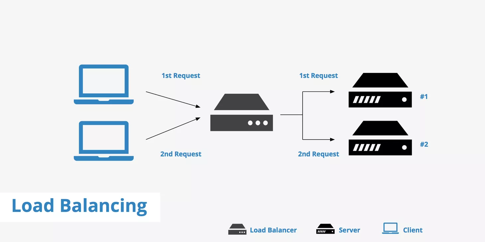
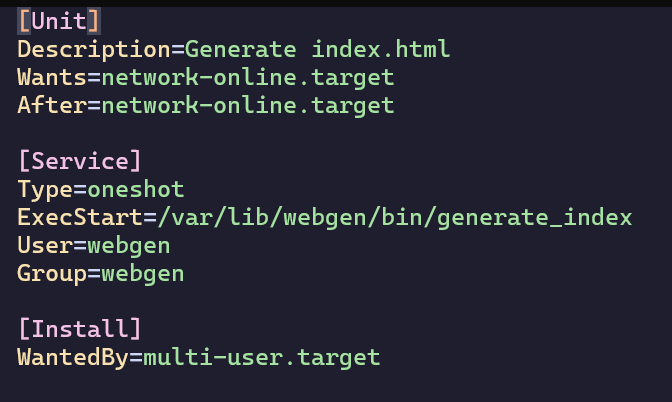
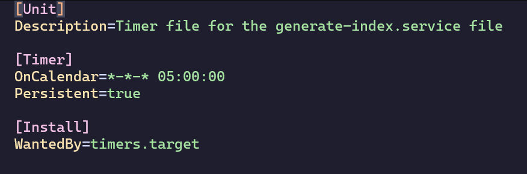
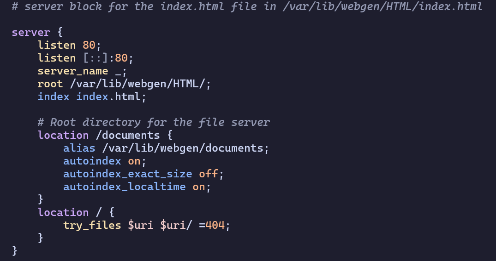
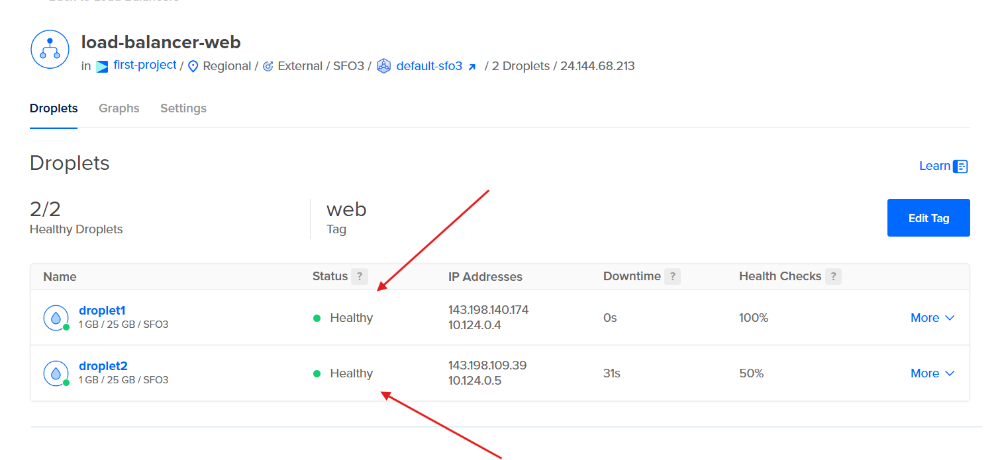
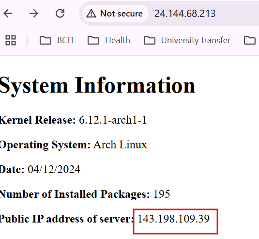
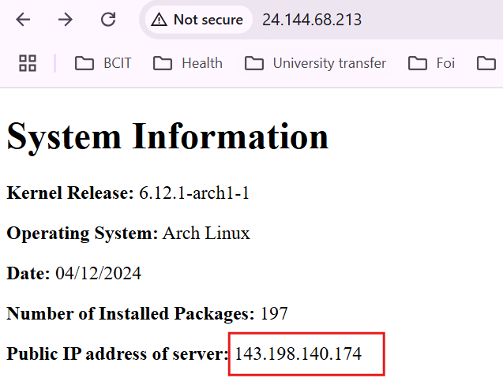
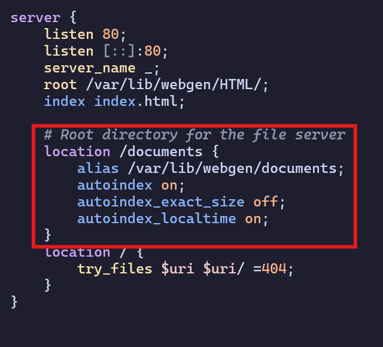
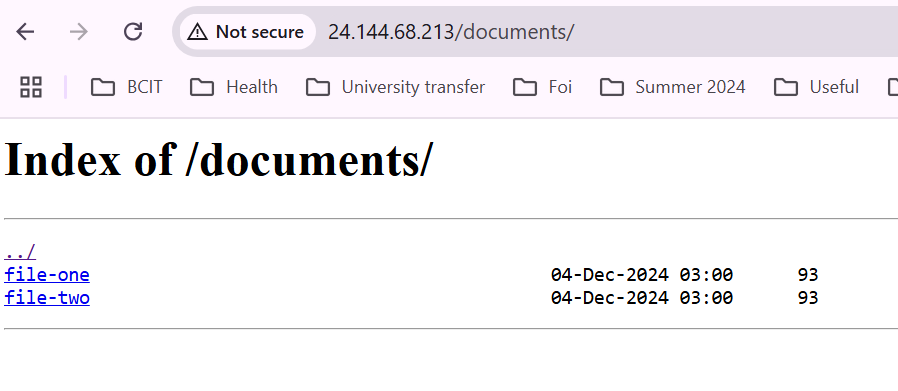
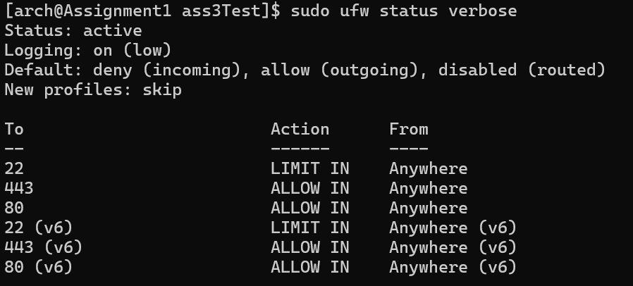

# Linux-Assignment-3-part-2
 
# SALOME CHELSIE LELE WAMBO - AO1372274

# Script Purpose

- This project sets up a Bash script to generate a static `index.html` file containing system information. The file is served by an Nginx web server and secured with a firewall using UFW. The system is automated using a systemd service and timer to run daily at 5:00 AM PST.
- The script is be imported in 2 servers hosted on DigitalOcean and the file server and web server is done automatically.
- The 2 servers are serviced via a load-balancer.  


## Features

- Automates the creation of a system user with a non-login shell.
- Clones necessary scripts and files from a remote repository.
- Generates an HTML page with system information such as:
  - Kernel release
  - Operating system name
  - Current date
  - Number of installed packages
  - System uptime
  - Disk usage (specific to `webgen`)
- Sets up systemd `.service` and `.timer` files for task automation.
- Configures an Nginx server block for serving files.
- Serves the HTML page using an Nginx on port 80.
- Secures the server with UFW by:
  - Allowing SSH and HTTP traffic
  - Enabling SSH rate limiting
- Provides setup instructions for a load balancer serving two servers on DigitalOcean.

## Prerequisites

- An Arch Linux Image uploaded on your DigitalOcean account.
- Basic bash scripting.
- An Arch Linux server.
- Root access or `sudo` privileges.
- Installed packages:
  - `nginx`
  - `ufw`
  - `git`
  Can be installed with `sudo pacman -S nginx ufw git`.  

## Part 1: Repository File Descriptions and Server Locations


### 1. **`setup_script`**
   - **Description**: Bash script designed to automate the setup and configuration of a web server, file server, and associated system services. The script simplifies the process of configuring Nginx, managing systemd services and timers, and setting up essential firewall rules.

   - **Location**: Run from any directory on the server.  
   > Note: Make the script executable before running it: `sudo chmod +x setup_script`. 

#### Features  

1. **Web and File Server Setup**:
   - Configures an Nginx web server to serve HTML pages and documents.
   - Sets up a file server for serving files with directory browsing enabled.

2. **Systemd Service and Timer Management**:
   - Creates and configures a `generate-index.service` to execute specific tasks.
   - Schedules the `generate-index.service` using `generate-index.timer`.

3. **Firewall Rules**:
   - Configures `ufw` (Uncomplicated Firewall) to allow HTTP and SSH traffic.
   - Limits SSH access to mitigate potential attacks.

4. **System User Management**:
   - Creates a dedicated system user (`webgen`) with a non login shell (**/usr/bin/nologin**)
> **Note**:  
**Why create a system user instead of a regular user or root user**  
- We're essentially running background processes (services, servers), meaning there is little to no interactive tasks performed. A **regular user** ir more appropriate when a person needs to log in, execute commands, or interact with the system. 
- A system user runs with least privileges as opposed to the root user (which grants top-level permissions and thus expose the system to security vulnerabilities)  


5. **Repository Integration**:
   - This script Clones and integrates required configuration files and scripts from 2 remote repositories.  
   1. "https://github.com/ChelsieSalome/Linux-Assignment-3-part-1.git"  
   2. "https://git.sr.ht/~nathan_climbs/2420-as3-p2-start"  

   - Provides functionality to reset the environment to avoid duplicate files or errors.

6. **Custom Environment options**:
   1. `[-r]` : reset option to clean up and remove all files, directories, and configurations created by the script.
   2. `[-i]` : Runs the script and execute the commands


### 2. Cloned Files:
The repositories from which the script will clone files, contain the startup files to set up and automate the generation of the `index.html` file. Below is a description of each file the required location on the server as well as the explanation of how the file will behave given their configurations:

 1. `generate_index`
- **Type**: Bash script
- Cloned from "https://git.sr.ht/~nathan_climbs/2420-as3-p2-start"  
- **Description**: script that generates the `index.html` file containing   system information.  
 - **Location**: `/var/lib/webgen/bin/`  

>#### Why this location?
- The `/var/lib/` directory is commonly used for application data files that are dynamically generated or updated.
- Placing the script in `/var/lib/webgen/bin/` ensures it is isolated within the `webgen` user's working environment, preventing interference with other system scripts or applications.
- Keeping the script in the `bin/` directory within the application's structure makes it easy to locate and execute as part of the `webgen` service's logic.
  - **File Explanation**:   
    - **Dynamic System Information:**

        - Automatically updates the HTML file with the system's current kernel version, OS name, date, package count, and public IP address.  

    - **Error Handling:** 
        - Exits immediately on errors to ensure the script does not run in an inconsistent state.
        - Includes detailed error messages for troubleshooting.

    - **Output Location:**  

        - The file is saved in /var/lib/webgen/HTML, which is later used in the server block to congigure nginx.

    - **Usage**:
        - The script `setup_script` automatically makes it executable before running it.


 2. `generate-index.service`
- **Type**: unit (service file)
- **Description**: A systemd service file that runs the `generate_index` script to update the `index.html` file.
- **Location**: `/etc/systemd/system/`

>#### Why this location?
- The `/etc/systemd/system/` directory is reserved for user-defined systemd service and timer files.
- Placing the `generate-index.service` here ensures it is recognized by systemd and can be managed using standard systemd commands (`systemctl enable`, `systemctl start`, etc.).
- This location is accessible to the systemd manager during boot and service initialization.  
- It is recommended to edit files in this location rather than in `/lib/systemd/system/` as this is the default directory that pacman uses to install softwares and updates. Thus files placed are usually overwritten when there are updates and upgrades .  
- **File Explanation**:  
  

### `[Unit]` Section
```ini
[Unit]
Description=Generate index.html
Wants=network-online.target
After=network-online.target
```

- **`Description=Generate index.html`**:
  - Provides a brief description of the service for identification in systemd commands.

- **`Wants=network-online.target`**:
  - Indicates that the service prefers the network to be fully initialized before starting but will not fail if the network is unavailable.

- **`After=network-online.target`**:
  - Ensures the service starts only after the `network-online.target` is reached, making it suitable for scripts that depend on network connectivity.

---

#### `[Service]` Section
```ini
[Service]
Type=oneshot
ExecStart=/var/lib/webgen/bin/generate_index
User=webgen
Group=webgen
```

- **`Type=oneshot`**:
  - Specifies that the service runs a single task and then exits. It is not a long-running daemon.

- **`ExecStart=/var/lib/webgen/bin/generate_index`**:
  - The command to execute when the service starts. It runs the `generate_index` script to generate the `index.html` file.

- **`User=webgen`** and **`Group=webgen`**:
  - Runs the service under the `webgen` user and group, ensuring it operates with limited permissions for enhanced security.


#### `[Install]` Section
```ini
[Install]
WantedBy=multi-user.target
```

- **`WantedBy=multi-user.target`**:
  - Indicates that the service should be started in the `multi-user.target`, the typical target for non-graphical multi-user systems.


>**How the Service Works**

1. When started, the service triggers the `generate_index` script.
2. The script collects system information and generates an HTML report (`index.html`).
3. The service runs as a one-time process (`oneshot`) under the `webgen` user for security.


3. `generate-index.timer`
- **Type**: unit (timer file)
- **Description**: A systemd timer file that schedules the `generate-index.service` to run daily at 5:00 AM (PST).
- **Location**: `/etc/systemd/system/`

>#### Why this location?
- Like the service file, the timer file must reside in `/etc/systemd/system/` as this is the preferred location for user-defined unit files.
- It is recommended to edit files in this location rather than in `/lib/systemd/system/` as this is the default directory that pacman uses to install softwares and updates. Thus files placed are usually overwritten when there are updates and upgrades .
- **File Explanation**:  
  

#### [Unit] Section  
1. **`[Unit]`**
   - Declares the unit section, which provides metadata about the timer file.

2. **`Description=Timer file for the generate-index.service file`**
   - A short description of the timer.  
#### [Timer] Section  
3. **`[Timer]`**
   - Declares the timer section, which contains the timer's configuration.

4. **`OnCalendar=*-*-* 05:00:00`**
   - Specifies the timer's schedule using the `OnCalendar` directive:
     - `*-*-*` to have the timer run every day. 
     - `05:00:00` specifies the time of day (5:00 AM).
    > Ensure this time is compatible with the timezon on your server. 
    > You can check the timezone with  `timedatectl` and  change it with   `timedatectl set-timezone Region/City` eg: `timedatectl set-timezone America/Vancouver`

5. **`Persistent=true`**
   - Ensures that the timer catches up on missed activations (e.g., if the system was powered off) and runs the associated service as soon as the system restarts.


4. `nginx.conf`
- **Description**: The main Nginx configuration file, modified to include the `sites-enabled` directory for managing server blocks.
- **Location**: `/etc/nginx/`

>#### Why this location?
- `/etc/nginx/` is the default directory for Nginx configuration files on most Linux distributions.
- Placing `nginx.conf` here ensures it is used by the Nginx service during startup.
- Including server blocks via `sites-enabled` in this file maintains modularity, allowing easier management of individual site configurations.  
- **File Explanation**: 

**Global Settings**
 **`user webgen;`**
   - Specifies the system user that the NGINX worker processes run as (`webgen`).

**`worker_processes  1;`**
   - Defines the number of worker processes to handle client requests. In this case, it's set to `1`.  

##### HTTP Block
**`http {`**
   - Starts the `http` block, which contains configurations for handling HTTP traffic.

**`include /etc/nginx/sites-enabled/*;`**
   - Includes all files in the `/etc/nginx/sites-enabled/` directory. This is where additional virtual host configurations are stored.


5. `generate-index.conf`
- **Description**: An Nginx server block configuration file that serves the `index.html` file.
- **Location**: `/etc/nginx/sites-available/`

>#### Why this location?
- The `/etc/nginx/sites-available/` directory is a standard location for storing individual server block configurations in Nginx.
- This structure separates the configuration of individual sites, keeping the main Nginx configuration file cleaner and more maintainable.
- From here, symbolic links are created to `/etc/nginx/sites-enabled/` for active configurations.  
- **File Explanation** :  

This configuration file defines an NGINX server that:
- Listens on port 80 (IPv4 and IPv6). (**`listen [::];`** & **`listen [::]:80;`**)
- Serves files from `/var/lib/webgen/HTML/`.
- Has a default file `index.html` for directory requests.
- Provides a `/documents` location block with directory listing enabled, mapped to `/var/lib/webgen/documents`.
- Handles root (`/`) requests and serves files if available, returning a 404 error otherwise.


## Part 2: Servers & Load Balancer Creation  
### Section 1: Load Balancer: Overview and Importance
  
#### **What is a Load Balancer?**
A **load balancer** is a device or software that distributes incoming network traffic across multiple servers. By efficiently allocating traffic, it ensures that no single server becomes overwhelmed, enhancing the availability and performance of applications and services.

---

#### **Why is a Load Balancer Useful?**

1. **Increased Availability and Reliability**:
   - If one server fails, the load balancer redirects traffic to other operational servers, minimizing downtime.

2. **Improved Performance**:
   - Distributes client requests evenly, optimizing resource usage and reducing response times.

3. **Scalability**:
   - Facilitates adding or removing servers to meet changing traffic demands, allowing applications to handle high or fluctuating loads.

4. **Redundancy**:
   - Ensures continuous operation by using multiple servers to handle traffic.

---

#### How does DigitalOcean Servers come into play? 

- In the case of two DigitalOcean servers (Droplets):
  - A load balancer can distribute incoming requests between the two servers.
  - This ensures that both servers share the workload, improving application performance and reliability.
  - If one server experiences an issue or goes offline, the load balancer directs all traffic to the other server, maintaining service availability.

- DigitalOcean offers **managed load balancers**, which are easy to configure and integrate with Droplets to automatically distribute traffic.

---

#### **What is the Difference Between a Load Balancer and a Server?**

##### **Load Balancer**:
- **Purpose**: Manages and distributes traffic across multiple servers.
- **Role**: Acts as an intermediary between clients and servers.
- **Primary Function**:
  - Balances the load to optimize performance.
  - Ensures redundancy and high availability.

##### **Server**:
- **Purpose**: Processes and fulfills client requests.
- **Role**: Stores and serves applications, websites, or services.
- **Primary Function**:
  - Executes tasks such as running applications or serving web pages.

---

#### **Key Takeaway**
- A load balancer **distributes and manages traffic** among servers, enhancing performance, availability, and scalability.
- Servers, on the other hand, handle the actual **processing of requests** and delivering data to clients.
- In a setup with two DigitalOcean servers, a load balancer ensures efficient use of resources, prevents overload, and provides redundancy to maintain uninterrupted service.


### Section 2: Setting Up Two Arch Linux Servers and a Load Balancer on DigitalOcean  

This guide walks you through creating two Arch Linux servers on DigitalOcean, configuring SSH access, updating your local SSH configuration, and setting up a load balancer to distribute traffic between the two nealy created servers.  

#### Step 1: Create SSH key-pair  

1. Run `ssh-keygen -t ed25519 -f ~/.ssh/key-name -C "youremail@email.com"` to create the ssh key pair.


2. Choosing a Passphrase  
You can protect the private key using a **passphrase**. A **passphrase** is just a string of characters used to add an additional layer of security to your private key through encryption.  

To make your life easier and avoid the hassle of remembering a passphrase, you can choose not to set one. To do this, simply press **ENTER** twice when prompted for a passphrase. This will create your SSH key without any passphrase protection. Successful completion of the ssh-key should look like:   

3. Verifying your SSH Keys  
Run `cd .ssh` > `ls` to view the files in the .ssh directory.  
> The keys are successfully created if you see the following files in the .ssh directory:  
* **key-name** *(private key)*  
* **key-name.pub** *(public key)*  


2. **Add SSH Key to DigitalOcean**:
   - On your DigitalOcean dashboard, go to **Settings** > **Security**.
   - Click **Add SSH Key** and paste the contents of your public key (`~/.ssh/lb-key.pub`).

#### Step 2: Create Two Arch Linux Droplets

1. **Log in to DigitalOcean**:
   - Access your account at [DigitalOcean](https://www.digitalocean.com/).

2. **Deploy Droplets**:
   - Click **Create** and select **Droplets**.
   - Choose your **Arch Linux** image from the **Custom Images** section.
   - Select the **San Francisco 3 (sfo3)** datacenter region.
   - Choose your desired plan (e.g., Basic with 1 CPU and 1GB RAM).
   - Under **Authentication**, select **SSH Key** and add your public key.
   - Assign the **hostname** as `droplet1` for the first server and `droplet2` for the second.
   - Add the **tag** `web` to both Droplets for easy management.
   - Select the newly created key for authentication when prompted.
   - Click **Create Droplet** to deploy each server.

3. **Note IP Addresses**:
   - After deployment, note the public IP addresses of both Droplets for SSH access and load balancer configuration.

   

#### Step 3: Update Local SSH Configuration

1. **Edit SSH Config File**:
   - On your local machine, edit the SSH configuration file:
   
   - Add the following entries:
     ```Host droplet1
         HostName <doplet1-ip>
         User <username>
         PreferredAuthentications publickey
         IdentityFile ~/.ssh/lb-key
         StrictHostKeyChecking no
         UserKnownHostsFile /dev/null

         Host droplet2
         HostName <doplet2-ip>
         User <username>
         PreferredAuthentications publickey
         IdentityFile ~/.ssh/lb-key
         StrictHostKeyChecking no
         UserKnownHostsFile /dev/null
     ```
   - Replace `<droplet1-ip>`, `<droplet2-ip>`, and `<username>` with the appropriate values.

#### Step 4: Test SSH Access
   - Connect to each Droplet using the configured hostnames:
     ```bash
     ssh droplet1
     ssh droplet2
     ```


#### Step 5: Set Up a Load Balancer

1. **Create the Load Balancer**:
   - On your DigitalOcean dashboard, navigate to **Networking** > **Load Balancers**.
   - Click **Create Load Balancer**.
   - Select the **San Francisco 3 (sfo3)** datacenter region to match your Droplets.
   - Under **Choose Droplets**, select the **web** tag to include both `droplet1` and `droplet2` as backend servers.
   - Configure the **Forwarding Rules**:
     - **Entry Protocol**: HTTP
     - **Entry Port**: 80
     - **Target Protocol**: HTTP
     - **Target Port**: 80
   - Assign the **tag** `web` to the load balancer for consistency.
   - Click **Create Load Balancer** to deploy it.

2. **Configure Health Checks**:
   - In the load balancer settings, ensure health checks are configured to monitor the Droplets' health. This typically involves checking a specific HTTP path to confirm the servers are responsive.  
   


### Notes

- **Consistency**: Ensure both Droplets have identical configurations and content to provide a seamless experience.

- **Scaling**: You can add more Droplets with the `web` tag to the load balancer as needed to handle increased traffic.


## Part 3: `setup_script` Explanation'  
### **1. `usage`**
- Displays usage instructions for the script and the available options.

### **2. `ensure_directory_exists`**
- Checks if a directory exists; creates it if not.

### **3. `check_file_exists`**
- Checks if a specific file exists and returns the result.

### **4. `chown_root`**
- Changes ownership of a file or directory to `root` and adjusts permissions.

### **5. `chown_webgen`**
- Changes ownership of a file or directory to the `webgen` user and group, and sets permissions.

### **6. `add_webgen`**
- Creates the `webgen` system user with no login shell and a dedicated home directory.

### **7. `create_dir_webgen`**
- Creates the required directory structure for the `webgen` application.

### **8. `clone_repository`**
- Clones the necessary repositories for the setup.

### **9. `create_document`**
- Creates sample files (`file-one` and `file-two`) for the file server.

### **10. `copy_files`**
- Copies systemd service and timer files to the appropriate locations.

### **11. `configure_nginx`**
- Configures the Nginx web server and updates the configuration to include `webgen`.  
### Purpose:  
This function:
1. Backs up the existing Nginx configuration file if it exists.
2. Replaces or sets up the main `nginx.conf` file.
3. Ensures the configuration is tailored to include necessary directives.
4. Creates essential directories for server blocks.
5. Links the configuration file from /etc/nginx/sites-available/ to /etc/nginx/sites-enabled/ via a symbolic link.
6. Tests the updated Nginx configuration and enables the Nginx service.
7.  Ensures that Nginx runs as the webgen user.
    - If a user directive already exists, it updates it to user webgen;.
    - If no user directive is present, it appends user webgen; to the configuration file.

### **12. `enable_service_and_timer`**
- Enables and starts the `generate-index.service` and `generate-index.timer`.  
#### **Function Purpose**
This function:
1. Reloads the systemd manager to recognize newly added or updated unit files. It is  essential after adding or modifying service or timer files.   
2. Enables and starts the `generate-index.service` to perform its task immediately and on boot. (`systemctl enable --now generate-index.service`)
3. Enables and starts the `generate-index.timer` to schedule periodic execution of the service. (`systemctl enable --now generate-index.timer`)  

### **13. `configure_ufw`**
- Configures the Uncomplicated Firewall (UFW) to allow SSH and HTTP traffic and activates the firewall.  
#### **Function Purpose**
This function:
1. Installs UFW using the package manager.
2. Configures UFW rules to allow SSH and HTTP traffic while limiting SSH access for security.
3. Enables the UFW firewall to enforce the configured rules.  (`ufw allow ssh`, `ufw allow http`, `ufw limit ssh`).
>Note: `ufw limit ssh` will drop any SSH connection attempt after a maximum of 6 connection attempts within a 30-second window from a single IP address.

### **14. `reset_environment`**
- Cleans up the environment by removing created files, directories, and the `webgen` user, by calling the functions defined earlier.

### **15. `install_environment`**
- Starts the setup process by calling all necessary functions in sequence.

## Part 4: Ensure your Load Balancer is up and running

### 1. checking the Web Server
After running the script on both servers, your nginx service will be active, meaning you would now be able to access both the servers and your load balancer via your browser. (eg http://24.144.68.213/)
1. You can copy your load-balancer's IP address from your DigitalOcean account and paste it in the browser of your choice.  
2. When refreshing the page a few times, you should notice some minr differences, indicating that the load-balancer is servicing both droplets or servers.  
 Here are some pictures for reference:  
  
   

### 2. Checking the File Server  
- Remember the route we defined in the server block earlier?   
- The section `location /documents` is what allows us the render the file   server on our browser by appending **/documents** at the end of the link as such http://24.144.68.213/documents.  
- You should see a similar output when you visit that url:
> Note: The files are downloadable !
  

# Troubleshooting Tips  
## 1. Nginx Fails to Start or Reload
- Run the following to check the configuration:
```bash
sudo nginx -t
```  
If there are syntax errors, review the changes made to /etc/nginx/nginx.conf or the server block file in /etc/nginx/sites-available/.  

## 2. "generate_index" Script Fails
* Check the logs for the systemd service:  
`journalctl -u generate-index.service`  

* Ensure the scripts is executable:  
`sudo chmod +x <path-to-the-setup-script>`
eg : `sudo chmod +x setup_script` is the script is in the current working directory


## 3. Missing Firewall Rules  
* Check the UFW status:
`sudo ufw status verbose`  
It should give you the following output:  



## 4. Site not accessible in browser or browser displaying the default Nginx index.html page  
* Verify Nginx is running:
`sudo systemctl status nginx`  

* Clear your browser's cache   **CTRL + SHIFT + R** on Windows
* Use a different browser.  

# Sources
1. https://learning.oreilly.com/library/view/linux-for-system/9781803247946/B18575_02.xhtml#_idParaDest-32  
2. https://wiki.archlinux.org/title/Nginx  
3. https://wiki.archlinux.org/title/Uncomplicated_Firewall  
4. https://www.digitalocean.com/community/tutorials/how-to-use-systemctl-to-manage-systemd-services-and-units  
5. https://www.digitalocean.com/community/tutorials/understanding-systemd-units-and-unit-files  
6. https://wiki.archlinux.org/title/Systemd/Timers  
7. https://www.digitalocean.com/community/tutorials/the-basics-of-using-the-sed-stream-editor-to-manipulate-text-in-linux
8. https://wiki.archlinux.org/title/Pacman


